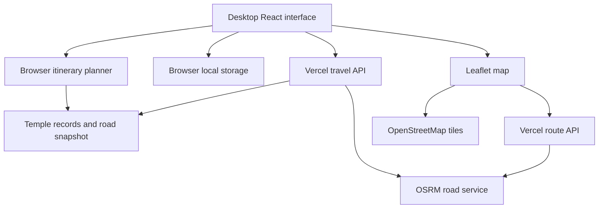

# Implemented architecture

The Vercel deployment runs Next.js with React and TypeScript. The browser holds the trip UI, Leaflet map, planner and local saved state. Two server routes obtain road data. Static temple records and a dated road-time snapshot are shipped with the application. No application database or agent runtime is required.

### Modules and files

- app/page.tsx owns preferences, day selection, generation, completion, delayed replanning, saved state and export.

- components/temple-map.tsx renders pins and road geometry. If geometry cannot be fetched, it displays a labeled connection line.

- lib/navagraha/planner.ts implements the bounded beam search, keeping up to 1,800 candidate states, and accounts for visit windows, lunch, day limits and completed visits.

- lib/navagraha/data.ts contains the nine temples and three origins. lib/navagraha/road-snapshot.json supplies the dated road-time fallback.

- app/api/travel/route.ts requests an OSRM duration matrix, adds 20 percent plus five minutes per leg and caches successful results in memory for one hour. On failure it returns the 28 September 2026 snapshot.

- app/api/route/route.ts requests OSRM route geometry. The map can try OSRM directly before falling back to a dashed line. None of these routes supplies live traffic.

### How a trip flows through the system

The pilgrim chooses a date, origin and pace. The browser requests the road matrix, then the planner schedules the nine core temples within the selected day limits. The UI displays each day and requests its route geometry. Completion updates local storage. A delayed replan preserves completed visits and reschedules the remainder.

### Deployment configuration

vercel.json selects Next.js, installs with pnpm install --frozen-lockfile, builds with pnpm run build:vercel and uses .next output. The build:vercel script runs next build --webpack. The older Sites/Vinext build remains in the repository; use the explicit Vercel commands when testing this deployment.

## Runtime data flow

The map also attempts OSRM directly if its server geometry request fails, then falls back to a labeled connection line. The original architecture image is a future design, not this runtime.
